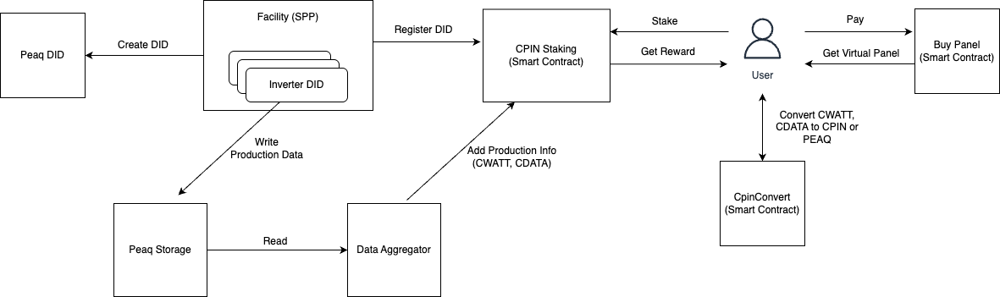

# CPIN Protocol

## Deployed Addresses on PEAQ Mainnet

- CPIN Token - 0x06E3cB6b9D0B4089eFF7431AB496362591183E83
- CWATT Token - 0x3556aA434Bdcf429D59183d65B6cf036722Ac259
- CDATA Token - 0xa65Dab5831898d9A63De0e67FCf68a34D19102bC
- Virtual Panel NFT - 0xa85c10190943BBc46dDE84024f9070e54987fa52
- CpinBuyPanel - 0x0A493a73860DBC93f6CDE70D83799c296b9ad79D
- CpinSppStaking - 0x5D19b364df25EBF6954296028B851BE38CB1f1a7
- CpinConverter - 0x22f1F42A0e7f47E3544e573C6B885658abEaF52d

## Architecture

- Facilities will create DID's for every data collection point they have like inverters.
- Every collected data will be sent by these Dids, hourly. The storage key must be like
  - cpin-production-2025-03-13-10 (the last number is the hour in range of 0-23)
- Data Aggregator, tracks all registered Dids and reads production information and aggregates them by facility
  and sends this information to staking contract. For details look cpin-data-aggregator repository.
- Users can buy virtual panels and stake. And they will get their reward and convert to CPIN or PEAQ
